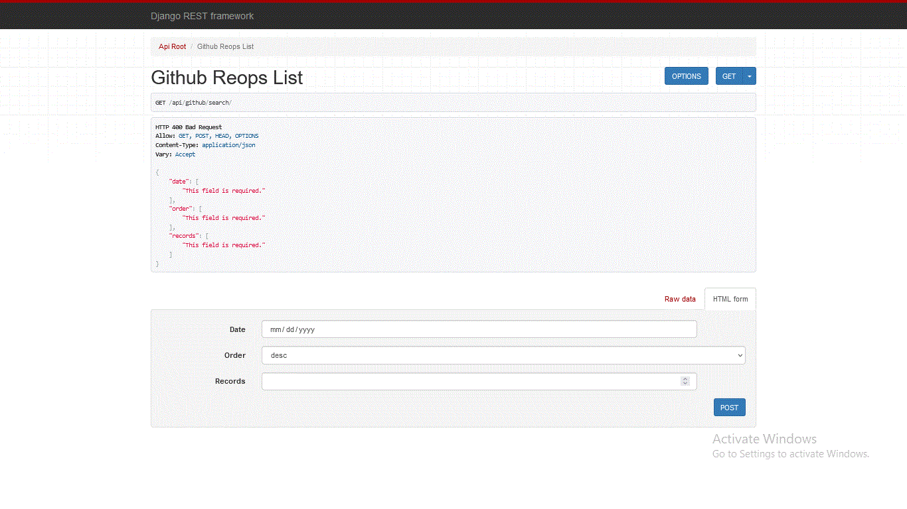
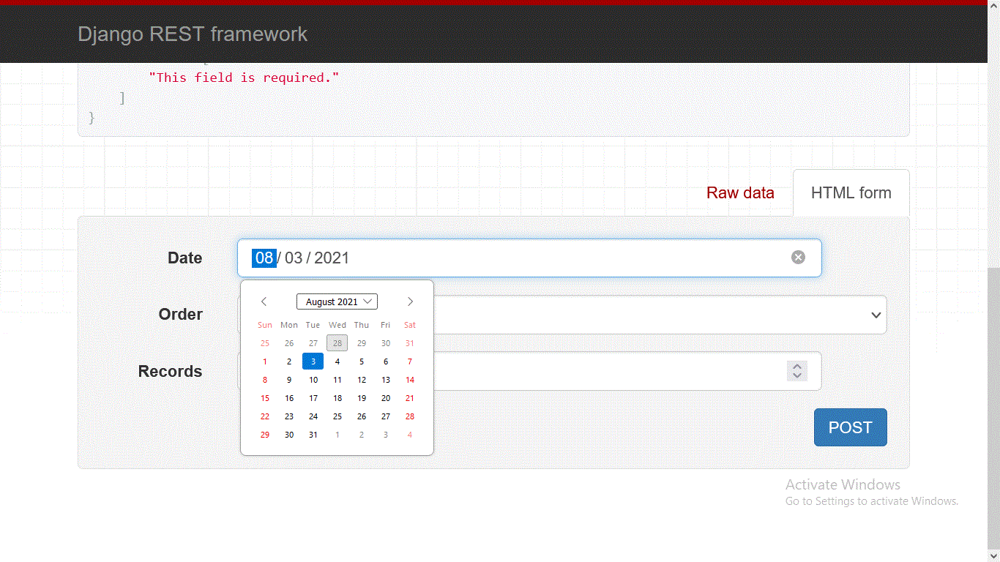
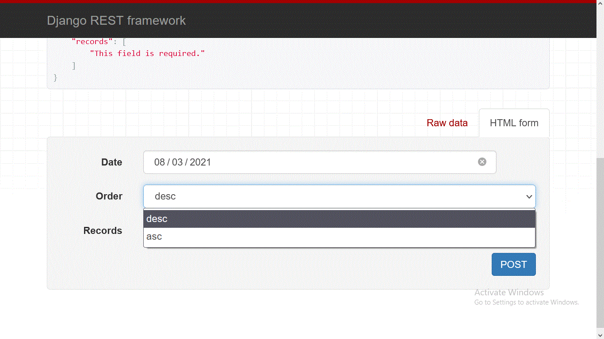
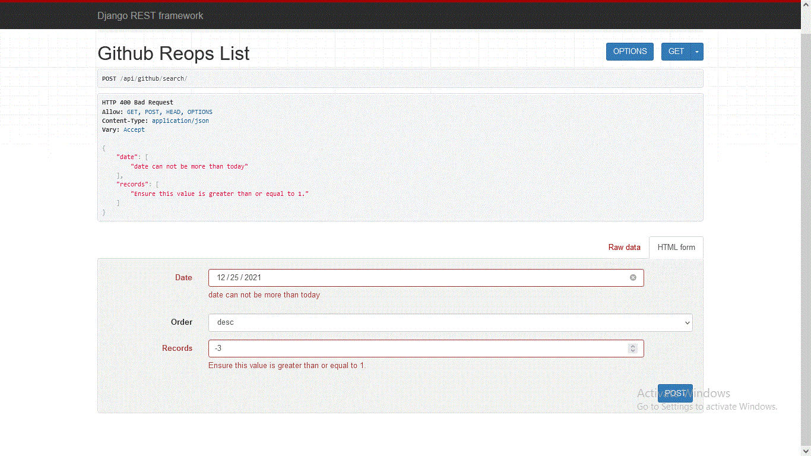
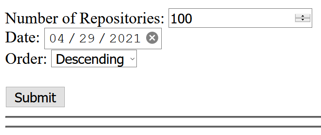
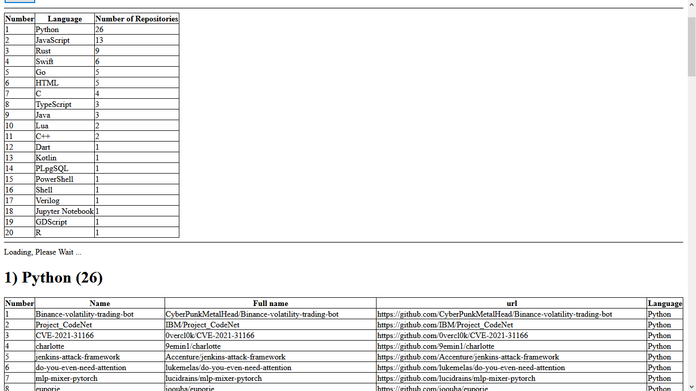
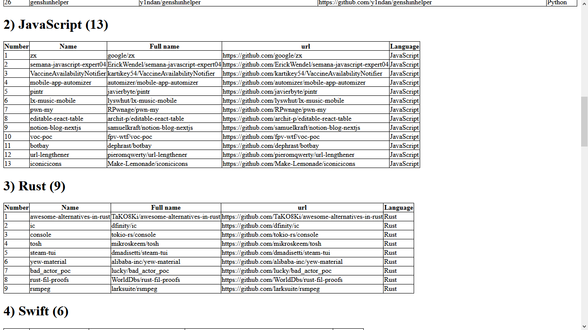
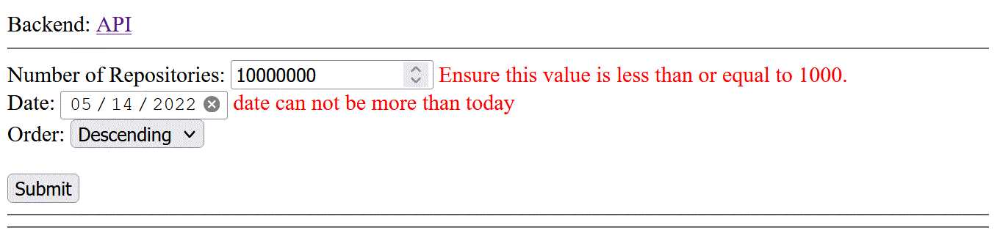

[](https://circleci.com/gh/OmarThinks/Gemography-Challenge-1)
[](https://circleci.com/gh/OmarThinks/Gemography-Challenge-1) 
[](https://raw.githubusercontent.com/OmarThinks/CircleCI-hello-world/master/LICENSE) 


# Gemography-Challenge-1
Submitting a challenge to Gemography


## Challenge Reference:

<a href="https://github.com/gemography/backend-coding-challenge">
Backend Challenge</a>


## How to run the application:

<b>

```bash
python manage.py runserver
```
</b>


## testing the application using usinttest:

<b>

```bash
python manage.py test
```
</b>


## testing the application using `pytest`:

<b>

```bash
pytest -rP
```

or


```bash
pytest app -rP --junitxml=test-reports/junit.xml --html=test-reports/pytest_report.html --self-contained-html
```

</b>
To print results in HTML file.


# 1) Backend (RESTful API):

The RESTful API has two endpoints:


## (GET) http://127.0.0.1:8000/api/github/search/:

The inputs are passed as query parameters:

- **`order`**: `asc` or `desc`
- **`date`**:
    - It has the format of **`YYYY-MM-DD`**
    - Example: `2019-4-25`
- **`records`**:
    - How many repositories do you want to check
    - Min Value : 1
    - Max Value : 1000

## (POST) http://127.0.0.1:8000/api/github/search/:


The same as the previous, but input is passed in request body.


# Examples:




### The date field:




### The order field:




### Validation:




# 2) Frontend:


The application has a frontend in this url:  
<a href="http://127.0.0.1:8000/">http://127.0.0.1:8000/</a> 


The frontend looks like this:


### Input Fields:




---

When submitting the result, it will look like this:


### Languages:




### Repositories of each language:




### Validation:




# 3) DevOps:

I am learing DevOps.  
The appilaction uses CircleCI.  
Every time commit an update, runs tests.  
And there are file generated by **`pytest`** as CircleCI Artifacts.  
These artifacts contain the results of the tests.


